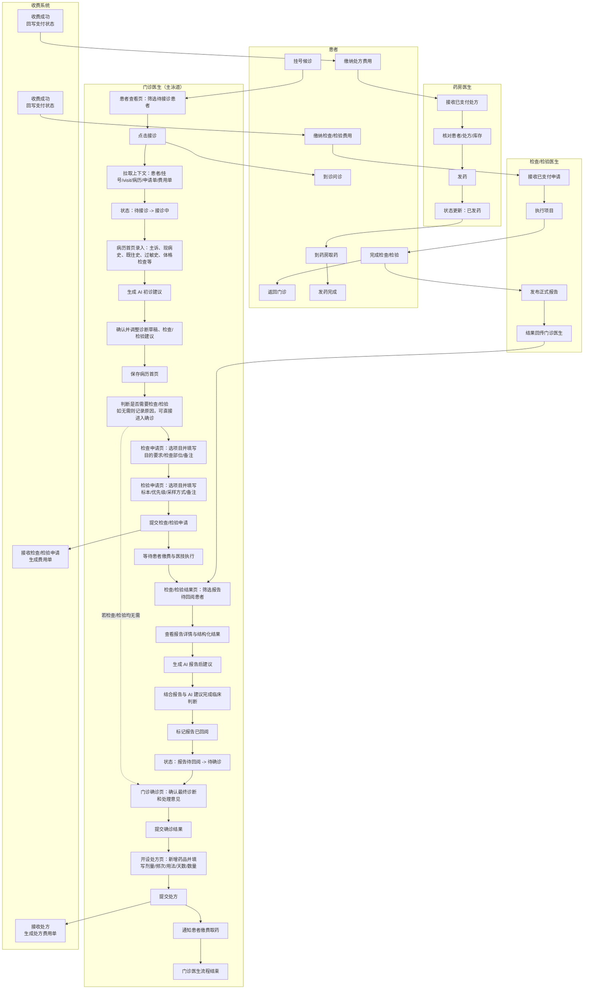

# 门诊医生泳道图设计

**日期**: 2026-07-03

## 背景

当前项目已经形成多角色协同门诊链路：

- `frontend`：包含门诊医生、检查医生、检验医生、挂号医生、药房医生工作台
- `backend`：负责门诊医生、处方、费用、报告回阅等主链路接口
- `backend-medical-exam`：负责检查/检验执行与报告发布
- `backend-registration`：负责挂号医生相关链路

本次目标不是实现新功能，而是整理一张 **门诊医生泳道图**，用于表达门诊医生从接诊到药房发药完成的完整业务闭环。

## 目标

输出一张以 **门诊医生为主视角** 的泳道图，满足以下要求：

1. 门诊医生泳道画得更细，展示页面动作、业务判断和状态推进
2. 患者、收费系统、检查/检验医生、药房医生只保留必要交互
3. 覆盖完整业务目标闭环：
   - `待接诊`
   - `接诊中`
   - 检查/检验申请
   - `报告待回阅`
   - `待确诊`
   - 处方开立
   - 药房发药完成

## 非目标

- 不在本次中分别展开挂号医生、检查医生、检验医生、药房医生的完整内部泳道
- 不按当前 mock 的未完全联动实现限制来收缩图的业务闭环
- 不补画退费、退药、异常中断等支线流程

## 选定画法

采用 **门诊主视角型**：

- 门诊医生泳道作为主泳道，节点颗粒度细化到“页面入口 + 操作动作 + 业务判断 + 状态变化”
- 其他泳道仅保留“触发点 / 回传点 / 闭环点”
- 图中优先表达主路径，避免把所有支线都展开导致主线不清

## 泳道定义

### 1. 患者泳道

只保留患者在主流程中的关键动作：

- 挂号候诊
- 到诊问诊
- 缴纳检查/检验费用
- 完成检查/检验
- 返回门诊
- 缴纳处方费用
- 到药房取药
- 发药完成

### 2. 门诊医生泳道

这是图中的主泳道，细化展示以下阶段：

1. 接诊阶段
2. 病历首页录入阶段
3. AI 初诊辅助阶段
4. 检查/检验决策与申请阶段
5. 报告回阅阶段
6. 门诊确诊阶段
7. 处方开立阶段
8. 通知患者缴费取药

### 3. 收费系统泳道

仅保留：

- 接收检查/检验申请并生成费用单
- 收费完成后回写支付状态
- 接收处方并生成费用单
- 收费完成后回写支付状态

### 4. 检查/检验医生泳道

仅保留：

- 接收已支付申请
- 执行项目
- 发布正式报告
- 将结果回传门诊医生

### 5. 药房医生泳道

仅保留：

- 接收已支付处方
- 核对患者、处方和库存
- 发药
- 更新状态为 `已发药`

## 主流程设计

### 1. 接诊

门诊医生在“患者查看”页筛选 `待接诊` 患者，点击“接诊”后：

- 系统拉取患者基本信息、挂号记录、就诊记录、病历、既有申请单与费用单
- 当前患者状态从 `待接诊` 进入 `接诊中`
- 门诊医生进入病历首页

### 2. 病历首页与 AI 初诊

门诊医生在病历首页录入：

- 主诉
- 现病史
- 现病治疗情况
- 既往史
- 过敏史
- 体格检查
- 诊断草稿
- 注意事项

如需辅助判断，可点击“生成初诊建议”，由 AI 返回：

- 诊断草稿
- 检查/检验建议
- 风险提示

门诊医生确认是否采纳 AI 建议后保存病历。

### 3. 检查/检验决策与申请

门诊医生根据病历与 AI 建议判断是否需要检查或检验：

- 若无需检查，则记录“本次无需检查”及原因
- 若无需检验，则记录“本次无需检验”及原因
- 若需要检查，则进入“检查申请”页填写项目、目的要求、检查部位、备注并提交
- 若需要检验，则进入“检验申请”页填写项目、检验目的、标本类型、优先级、采样方式、备注并提交

提交成功后：

- 系统生成检查/检验申请单
- 系统同步生成对应费用单
- 患者进入缴费与执行环节

### 4. 报告回阅

患者完成缴费并由检查/检验医生发布正式报告后，门诊医生在“检查/检验结果”页筛选 `报告待回阅` 患者。

进入报告详情后，门诊医生可查看：

- 报告列表
- 结果摘要
- 所见
- 结论
- 结构化检查结果
- 结构化检验结果

门诊医生点击“生成 AI 建议”后，系统返回：

- 报告后诊断建议
- 处理意见
- 处方建议
- 风险提示

门诊医生结合报告和 AI 建议完成临床判断，并在进入确诊前：

- 将报告标记为 `已回阅`
- 将患者状态推进到 `待确诊`

### 5. 门诊确诊

门诊医生在“门诊确诊”页查看 AI 回填内容，并最终确认：

- 最终诊断
- 最终处理意见

提交确诊后，本次门诊诊断定稿。

### 6. 开设处方与发药闭环

门诊医生进入“开设处方”页：

- 新增药品
- 填写剂量
- 填写频次
- 填写用法
- 填写天数
- 填写数量

提交处方后：

- 系统生成处方记录
- 系统生成处方费用单
- 患者完成缴费后前往药房
- 药房医生核对并发药
- 处方状态更新为 `已发药`
- 门诊闭环完成

## 可选分支说明

为保证主路径清晰，图中仅弱化表示以下分支，不在泳道图中大幅展开：

1. 检查、检验都不需要时，门诊医生可在记录原因后直接进入确诊与处方阶段
2. 只需要检查或只需要检验时，主流程仍成立，只是减少一类申请和一类报告
3. 病历首页保存、申请单草稿暂存、报告多次切换查看等页面级细节不再单独画成并行支线

## Mermaid 版本

## 成功标准

满足以下条件即可认为这张泳道图可用：

1. 门诊医生主泳道比其他角色泳道明显更细
2. 图中能清楚看出门诊状态推进和主要页面动作
3. 图中保留了检查/检验、收费、药房三个关键协作触点
4. 图可以直接用于汇报文档、说明材料或后续补画其他医生泳道图
