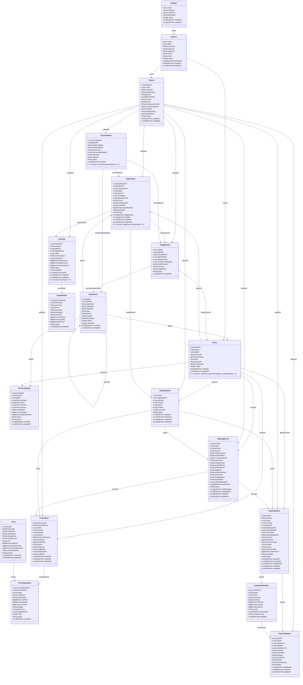

# Patient System - 类图 (Entity Class Diagram)

```mermaid
classDiagram
    class Patient {
        +Long patientId
        +Long userId
        +String patientNo
        +String patientName
        +String gender
        +LocalDate birthday
        +String idCard
        +String phone
        +String emergencyContact
        +String emergencyPhone
        +String address
        +String allergyHistory
        +String pastHistory
        +Integer status
        +LocalDateTime createdAt
        +LocalDateTime updatedAt
    }

    class Doctor {
        +Long doctorId
        +Long userId
        +Long deptId
        +String doctorNo
        +String doctorType
        +String title
        +String specialty
        +String introduction
        +Integer status
        +LocalDateTime createdAt
        +LocalDateTime updatedAt
        %~~ transient: realName, appointmentStatus, availableQuota ~~%
    }

    class Department {
        +Long deptId
        +Long parentId
        +String deptCode
        +String deptName
        +String deptType
        +String floor
        +String phone
        +String location
        +String description
        +Integer status
        +Integer sortOrder
        +LocalDateTime createdAt
        +LocalDateTime updatedAt
    }

    class DoctorSchedule {
        +Long scheduleId
        +Long doctorId
        +Long deptId
        +LocalDate workDate
        +String timePeriod
        +LocalTime startTime
        +LocalTime endTime
        +Integer totalQuota
        +Integer remainQuota
        +BigDecimal registrationFee
        +String status
        +String source
        +LocalDateTime createdAt
        +LocalDateTime updatedAt
    }

    class Registration {
        +Long registrationId
        +Long patientId
        +Long consultationId
        +Long deptId
        +Long doctorId
        +Long scheduleId
        +Long operatorUserId
        +String source
        +String registrationNo
        +Integer queueNo
        +BigDecimal registrationFee
        +String feeStatus
        +String status
        +LocalDateTime registeredAt
        +LocalDateTime calledAt
        +LocalDateTime createdAt
        +LocalDateTime updatedAt
        %~~ transient: deptName, doctorName ~~%
    }

    class OutpatientVisit {
        +Long visitId
        +Long registrationId
        +Long patientId
        +Long doctorId
        +Long deptId
        +String visitNo
        +Integer queueNo
        +String status
        +LocalDateTime startedAt
        +LocalDateTime finishedAt
        +LocalDateTime createdAt
        +LocalDateTime updatedAt
    }

    class MedicalRecord {
        +Long recordId
        +Long visitId
        +Long patientId
        +Long doctorId
        +String chiefComplaint
        +String presentIllness
        +String currentTreatment
        +String pastHistory
        +String allergyHistory
        +String physicalExam
        +String auxiliaryExam
        +String diagnosis
        +String treatmentAdvice
        +String doctorNote
        +String finalDiagnosis
        +String finalOpinion
        +Long confirmedDoctorId
        +LocalDateTime confirmedAt
        +String status
        +LocalDateTime initialSavedAt
        +LocalDateTime completedAt
        +LocalDateTime createdAt
        +LocalDateTime updatedAt
    }

    class Prescription {
        +Long prescriptionId
        +String prescriptionNo
        +Long visitId
        +Long recordId
        +Long patientId
        +Long doctorId
        +BigDecimal totalAmount
        +String feeStatus
        +String auditStatus
        +String status
        +String diagnosis
        +String usageNote
        +Long auditDoctorId
        +String auditNote
        +LocalDateTime auditedAt
        +LocalDateTime createdAt
        +LocalDateTime updatedAt
    }

    class PrescriptionItem {
        +Long prescriptionItemId
        +Long prescriptionId
        +Long drugId
        +String drugName
        +String specification
        +BigDecimal unitPrice
        +BigDecimal quantity
        +BigDecimal amount
        +String dosage
        +String frequency
        +String usageMethod
        +Integer days
        +String status
        +LocalDateTime createdAt
    }

    class Drug {
        +Long drugId
        +String drugCode
        +String drugName
        +String specification
        +String dosageForm
        +String manufacturer
        +String unit
        +BigDecimal salePrice
        +BigDecimal stockQuantity
        +BigDecimal warningQuantity
        +String contraindication
        +Integer status
        +LocalDateTime createdAt
        +LocalDateTime updatedAt
    }

    class FeeOrder {
        +Long feeOrderId
        +String orderNo
        +Long patientId
        +Long registrationId
        +Long visitId
        +String businessType
        +Long businessId
        +BigDecimal totalAmount
        +BigDecimal paidAmount
        +BigDecimal refundAmount
        +String status
        +Long createdBy
        +LocalDateTime paidAt
        +LocalDateTime createdAt
        +LocalDateTime updatedAt
        %~~ transient: itemType ~~%
    }

    class FeeOrderItem {
        +Long feeOrderItemId
        +Long feeOrderId
        +String itemType
        +Long itemId
        +String itemCode
        +String itemName
        +String itemSpec
        +BigDecimal unitPrice
        +BigDecimal quantity
        +BigDecimal amount
        +String status
        +LocalDateTime createdAt
    }

    class ExamLabOrder {
        +Long orderId
        +String orderNo
        +Long visitId
        +Long recordId
        +Long patientId
        +Long applyDoctorId
        +Long executeDeptId
        +String orderType
        +String clinicalDiagnosis
        +String purpose
        +String examSite
        +String specimenType
        +String remark
        +String priority
        +String collectionWay
        +BigDecimal totalAmount
        +String feeStatus
        +String status
        +LocalDateTime appliedAt
        +LocalDateTime executedAt
        +LocalDateTime completedAt
        +LocalDateTime createdAt
        +LocalDateTime updatedAt
    }

    class ExamLabOrderItem {
        +Long orderItemId
        +Long orderId
        +Long itemId
        +String itemName
        +String itemType
        +BigDecimal unitPrice
        +BigDecimal quantity
        +BigDecimal amount
        +String status
        +LocalDateTime executedAt
        +String resultSummary
        +LocalDateTime createdAt
    }

    class ExamLabReport {
        +Long reportId
        +Long orderId
        +Long orderItemId
        +Long patientId
        +Long reportDoctorId
        +String reportNo
        +String reportType
        +String findings
        +String conclusion
        +String aiDraft
        +String doctorReview
        +String status
        +LocalDateTime publishedAt
        +LocalDateTime createdAt
        +LocalDateTime updatedAt
    }

    class SysUser {
        +Long userId
        +Long roleId
        +String username
        +String password
        +String realName
        +String phone
        +String email
        +Integer status
        +LocalDateTime lastLoginAt
        +LocalDateTime createdAt
        +LocalDateTime updatedAt
    }

    class SysRole {
        +Long roleId
        +String roleCode
        +String roleName
        +String description
        +Integer status
        +LocalDateTime createdAt
        +LocalDateTime updatedAt
    }

    class AiConsultation {
        +Long consultationId
        +Long patientId
        +String chiefComplaint
        +String symptomDetail
        +String aiSummary
        +Long recommendedDeptId
        +String riskLevel
        +String aiResult
        +String status
        +LocalDateTime createdAt
        %~~ transient: recommendedDeptName ~~%
    }

    class TriageRecord {
        +Long triageId
        +Long patientId
        +Long consultationId
        +Long registrationId
        +Long triageDoctorId
        +Long recommendedDeptId
        +String chiefComplaint
        +String riskLevel
        +String triageResult
        +String status
        +LocalDateTime createdAt
    }

    %% ========== Relationships ==========

    %% Department self-reference
    Department --> Department : parentId

    %% Department → Doctor / Schedule / Registration
    Department --> Doctor : deptId
    Department --> DoctorSchedule : deptId
    Department --> Registration : deptId

    %% Doctor → associated entities
    Doctor --> DoctorSchedule : doctorId
    Doctor --> Registration : doctorId
    Doctor --> OutpatientVisit : doctorId
    Doctor --> MedicalRecord : doctorId
    Doctor --> Prescription : doctorId
    Doctor --> ExamLabOrder : applyDoctorId

    %% SysUser → SysRole / Doctor / Patient
    SysRole --> SysUser : roleId
    SysUser --> Doctor : userId
    SysUser --> Patient : userId

    %% Patient → all patient-related entities
    Patient --> Registration : patientId
    Patient --> OutpatientVisit : patientId
    Patient --> MedicalRecord : patientId
    Patient --> Prescription : patientId
    Patient --> FeeOrder : patientId
    Patient --> ExamLabOrder : patientId
    Patient --> ExamLabReport : patientId
    Patient --> AiConsultation : patientId
    Patient --> TriageRecord : patientId

    %% Registration → downstream visit
    Registration --> OutpatientVisit : registrationId
    Registration --> FeeOrder : registrationId
    Registration --> TriageRecord : registrationId

    %% OutpatientVisit → visit-based entities
    OutpatientVisit --> MedicalRecord : visitId
    OutpatientVisit --> Prescription : visitId
    OutpatientVisit --> ExamLabOrder : visitId

    %% MedicalRecord → record-based entities
    MedicalRecord --> Prescription : recordId
    MedicalRecord --> ExamLabOrder : recordId

    %% Prescription → PrescriptionItem
    Prescription --> PrescriptionItem : prescriptionId

    %% Drug → PrescriptionItem
    Drug --> PrescriptionItem : drugId

    %% FeeOrder → FeeOrderItem
    FeeOrder --> FeeOrderItem : feeOrderId

    %% ExamLabOrder → items & reports
    ExamLabOrder --> ExamLabOrderItem : orderId
    ExamLabOrder --> ExamLabReport : orderId
    ExamLabOrderItem --> ExamLabReport : orderItemId

    %% AiConsultation → Registration / TriageRecord
    AiConsultation --> Registration : consultationId
    AiConsultation --> TriageRecord : consultationId
    AiConsultation --> Department : recommendedDeptId

    %% TriageRecord → Department / Doctor
    TriageRecord --> Department : recommendedDeptId
    TriageRecord --> Doctor : triageDoctorId
```
